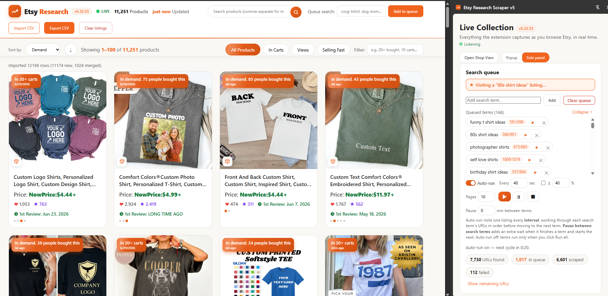

# iScale Etsy

iScale Etsy is a local-first Chrome extension for Etsy product
research. It can collect listings while you browse, run multi-term batch
scrapes, import older CSV exports, merge everything into one accumulated
research table, and export the current filtered view.



The goal is simple: give makers, researchers, and builders a useful open-source
Etsy research tool without requiring a hosted backend, account, or private API.

## What It Does

- Scrape many Etsy search terms in one batch.
- Visit up to 10 search result pages per term by default.
- Save discovered listing URLs locally.
- Visit listing pages one by one at a conservative pace, roughly 30 seconds per
  listing page by default — with an optional ±% randomization and an extra
  configurable pause between search terms so the cadence never looks robotic.
- Collect listing data into browser-local IndexedDB.
- Capture full **search-results** data automatically — for every Etsy search you
  open, it records which keyword was used, the page, each listing's position,
  title, price, rating, review count, image, and whether it was an ad — and
  accumulates each appearance with a timestamp so you keep the full ranking
  history per keyword.
- Accumulate results across multiple sessions.
- Watch it happen live: a toolbar badge counts everything collected, and a Live
  Collection dashboard streams each capture in real time.
- Auto-download a CSV automatically every N new listings (set it and forget it),
  optionally into a Downloads subfolder you choose, with an optional
  clear-after-export mode to keep local storage small.
- Auto-retry failed URLs when the auto-run is idle, with per-term run buttons,
  a retry-failed button, and clear controls for the feed and the collection.
- Import older CSV files from previous days into the same combined results.
- Merge and dedupe imported CSV rows with fresh scrape rows.
- Filter and sort the Shop View by demand, price, reviews, favorites, chips, and text search.
- Export the current filtered combined view as CSV.
- **Recreate the shop page locally** — a built-in Shop View renders your
  listings as a product-card grid (image, price, demand badge, digital/physical
  tag, favorites, reviews) sortable by demand, price, favorites, reviews, first
  review, or recency — entirely from your own data, no backend.

## Why v5?

The `v5` name keeps this open-source, local-first public edition clearly
separate from earlier private/internal scraper experiments.

## Local-First Privacy

This extension stores scrape data in your browser using IndexedDB. CSV imports
are parsed locally in your browser. CSV exports are generated locally from your
browser data.

There is no Supabase dependency, no hosted database, no account system, and no
private iScaleLabs production endpoint in this public edition.

## Install From Source

1. Clone or download this repository.
2. Open Chrome and go to `chrome://extensions`.
3. Enable Developer mode.
4. Click **Load unpacked**.
5. Select the `public-etsy-scraper-v5` folder.
6. Pin the extension if you want quick access to the popup.
7. Open the popup to start a batch, or open the Shop View to browse/import/export CSVs.

## Basic Workflow

1. Enter one or more Etsy search terms in the popup — each becomes a queued
   term pill.
2. Keep the default 10 pages per term, or choose a smaller number for a test.
3. Click **▶ Run all** to start the local batch (or ▶ on a single pill to run
   just that term). Pause, resume, or stop anytime.
4. Open the Shop View (or the live dashboard) to watch accumulated results.
5. Import older CSV files from previous runs when you want to rebuild or extend
   your research warehouse.
6. Filter by source/search term/text.
7. Export the current filtered view.

## Search Results Capture

Open any Etsy search and the extension automatically records the full result set:
the **keyword**, the **page**, and for each listing its **position**, title,
price, rating, review count, image, and ad flag. Every capture is timestamped and
appended to that listing's appearance history for the keyword, so you can see how
a listing's rank moved over time. The dashboard shows a running "Search results"
count and a live feed entry per search; **Export search results CSV** downloads
everything (including the full appearance history as JSON).

## Live Collection Dashboard

The extension shows what it is collecting, as it collects it:

- The **toolbar badge** shows your running total of collected listings — visible
  without opening anything.
- Clicking the toolbar icon opens the **dashboard** (`dashboard.html`) as a
  popup; a top-right toggle switches it into Chrome's side panel — same UI either
  way.
- The dashboard streams a live feed of every capture as you browse — title,
  demand, digital/physical — with running totals (total collected, with demand,
  search results) that update in real time, plus live batch-scrape progress.
- **Auto-download CSV:** set "auto-download every N new listings" and the
  extension writes a full CSV automatically each time that many new listings
  accumulate. Set it to 0 to turn it off; you can still export manually anytime.

### Side panel mode

Toggle **Side panel mode** (in the popup or the dashboard) to dock the live
dashboard into Chrome's side panel so it stays open beside Etsy while you browse.
With it on, clicking the toolbar icon opens the side panel; with it off,
everything stays as it is now (popup + tabs). Both modes are fully functional and
the toggle is available in each. Requires Chrome 114+.

## Shop View

Open **Shop View** from the popup (or load `shop.html`) to get a polished,
storefront-style view of your own data, built entirely from your scrapes and
CSV files — no backend, nothing leaves your browser:

- **Product-card grid** with image, title, price, a demand badge, a
  digital/physical type badge, favorites, review count, and a "1st Review: date"
  badge.
- **Demand history** — every time you scrape a listing again, a new demand
  snapshot is recorded (newest first, an entry under an hour old is updated in
  place, capped at 30). Cards with multiple snapshots **cycle** through them with
  a relative-time label and dots.
- **Sort** by Recent, Demand, Reviews, 1st Review, Price, or Favorites, with a
  direction toggle. Missing values sort last; ties break by most-recently
  scraped.
- **Filter chips** (All / In Carts / Views / Selling Fast), comma-separated
  text search, and a demand-phrase filter.
- **Pagination** at 100 per page with "Showing X–Y of Z".
- **De-duplication** by listing URL, preferring the live (non-deleted),
  most-recently-scraped copy; deleted listings are kept and shown as "No longer
  available".

Load a bunch of CSV files and you get your own local storefront view. It
accepts v5 exports as well as older CSVs (it understands both `camelCase` and
`snake_case` column names, including a JSON `demand_history` column).

## CSV Import

The Shop View can import one or more CSV files. Imported rows become normal local
listing records and are merged into the same accumulated results as fresh scrapes.

Rows are deduped by normalized Etsy listing URL or listing ID when available.
This means older CSV exports from previous days can be brought back into the
Shop View, merged, sorted, filtered, and exported again.

## CSV Export

The Shop View exports your accumulated listings as CSV (all columns, including
the JSON `demand_history`). Export everything anytime, or set an auto-download
threshold on the dashboard to export automatically as listings accumulate.

## Agent-Friendly Actions

The extension is designed around explicit local actions such as:

- `job.estimate`
- `job.create`
- `job.start`
- `job.pause`
- `job.resume`
- `job.stop`
- `jobs.list`
- `export.csv`

This keeps the human UI and future agent/chat control working against the same
local state model.

## Project Scripts

From this folder after installing dependencies:

```bash
npm test
npm run lint
```

## Responsible Use

Use this tool respectfully. You are responsible for how you use it, including
your compliance with Etsy's terms, robots guidance, and applicable laws. The
default timing is intentionally conservative.

This project is not affiliated with, endorsed by, or sponsored by Etsy, Inc.
"Etsy" is a trademark of Etsy, Inc., used here only to describe what the tool
works with.

## Built By

Created by iScaleLabs as a free, open-source research tool for builders.

## Project Docs

- [CONTRIBUTING.md](CONTRIBUTING.md) — how to contribute (maintainer-led, DCO sign-off)
- [GOVERNANCE.md](GOVERNANCE.md) — how decisions are made
- [SECURITY.md](SECURITY.md) — how to report vulnerabilities privately
- [SUPPORT.md](SUPPORT.md) — where to ask for help
- [CODE_OF_CONDUCT.md](CODE_OF_CONDUCT.md) — community standards
- [PRIVACY.md](PRIVACY.md) — what stays local (everything)
- [NOTICE.md](NOTICE.md) and [TRADEMARKS.md](TRADEMARKS.md) — attribution and brand boundaries

## License

MIT. See [LICENSE](LICENSE).
